# 10-Layouts-in-10-CSS-Lines
Minimal Modern CSS layouts in just 10 lines of CSS

## 1. Centered 

```css
.container {
    display: grid;
    place-items: center;
}
```
Centering is one of the most challenging task in CSS. This centers everything perfectly (both horizontally and vertically)

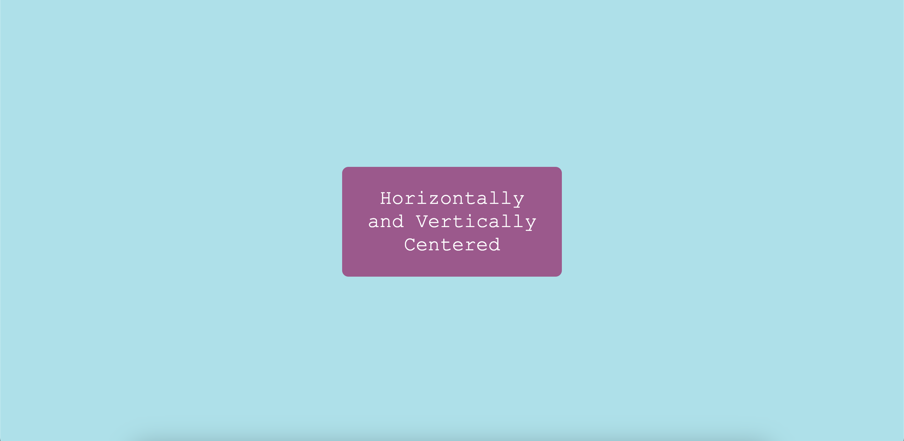

---

## 2. Stacked Elements 

Using flex and its `justify-content: center` property the following elements can be stacked and made responsive. 

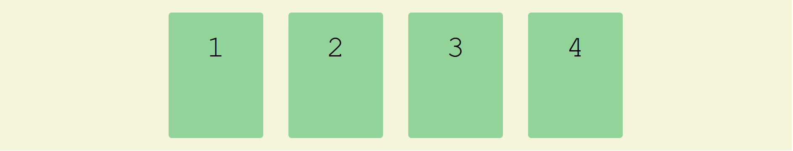
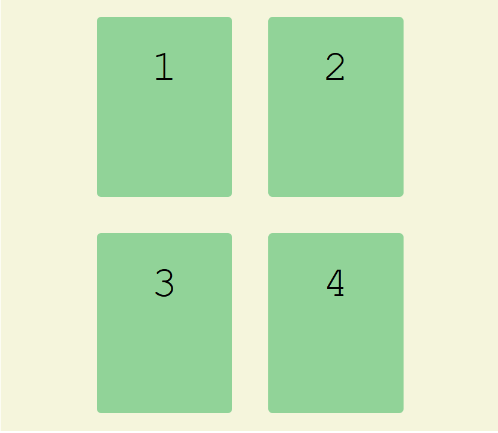

---

## 3. Sidebar Says

Creating a Sidebar 

```css
.container {
    display: grid;
    grid-template-columns: minmax(150px, 25%) 1fr;
}
```
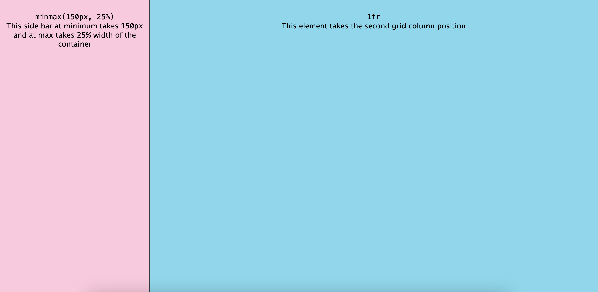

--- 

## 4. Clamp an Element 

`width: clamp(20ch, 50%, 50ch);` clamps the width of card between `20ch` and `50ch`


--- 

## 5. Centered Cards

Cards are centered using flexbox. 

```css
.container {
    display: flex;
    justify-content: center;
    /*Aligns content horizontally */
}
```
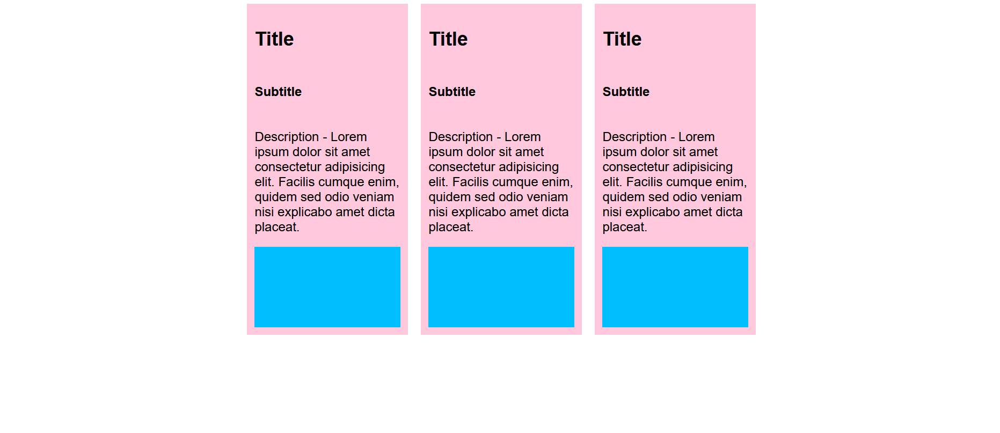

--- 

## 6. Vertical Stacked Layout

Header, Main and Footer are stacked using grid

```css
.body {
    display: grid;
    grid-template-rows: auto 1fr auto;
}
```
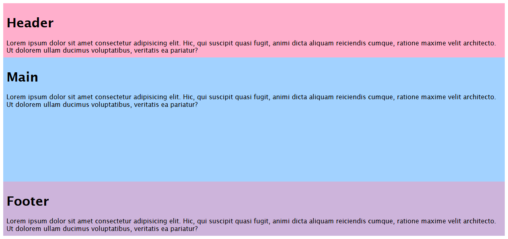


--- 

## 7. Classic Layout 

```css
body {
    display: grid;
    grid-template-rows: auto 1fr auto;
    grid-template-columns: auto minmax(600px, 1fr) auto;
    height: 100vh;
    
}
header {
    grid-column: span 3;
}
.left-section {
    grid-column: 1/2;
}
main {
    grid-column: 2/3;
}
.right-section {
    grid-column: 3/4;
}
footer {
    grid-column: span 3;
}
```
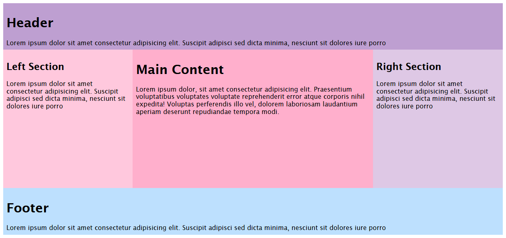


--- 

## 8. Article Layout 

```css
.container {
    display: grid;
    grid-template-columns: minmax(1rem, 1fr) minmax(auto, 65ch) minmax(1rem, 1fr);
    /*Second Column will not be more than 65 characters long
    and First and Third Column will reduce to 1rem in mobile screen*/
    width: 100%;
}
.container>* {
    grid-column: 2;
    /*Every immediate child should be assigned to that second middle column. Each new child will create a new row*/
    text-align: justify;
}
.image-full-bleed {
    grid-column: 1/-1;
    /*From First Column to Last*/
}
.image-full-bleed img {
    width: 100%;
}
```

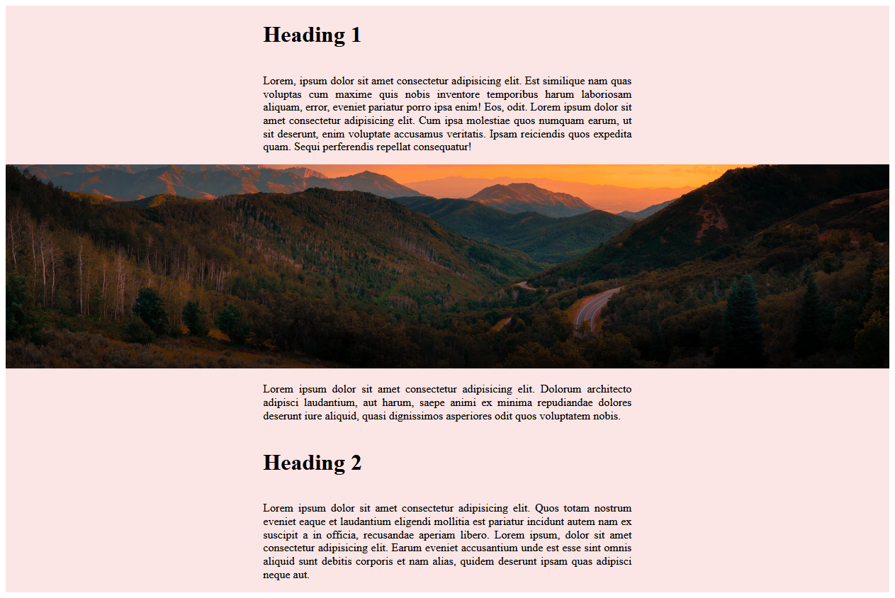
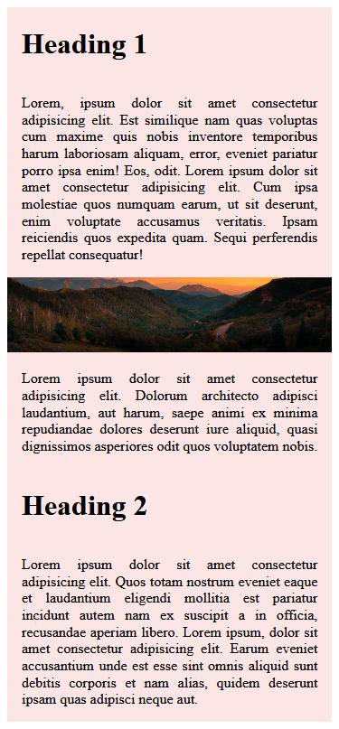


--- 

## 9. Responsive Image Grid

```css
.image-grid {
    display: grid;
    gap: 10px;
    grid-template-columns: repeat(auto-fill, minmax(250px, 1fr));
    grid-auto-rows: 260px;
    grid-auto-flow: dense;
    /*This property uses dense packing algorithm to fill holes in the grid
    by moving the items up in the row to fill the grid*/
}
/* Medium screens and above*/
@media screen and (min-width: 600px) {
    .card-tall {
        grid-row: span 2 / auto;
        /*At minimum it will span 2 row but can take up more rows as well*/
    }
    .card-wide {
        grid-column: span 2 / auto;
        /*At minimum it will span 2 columns but can take up more rows as well*/
    }
}
```
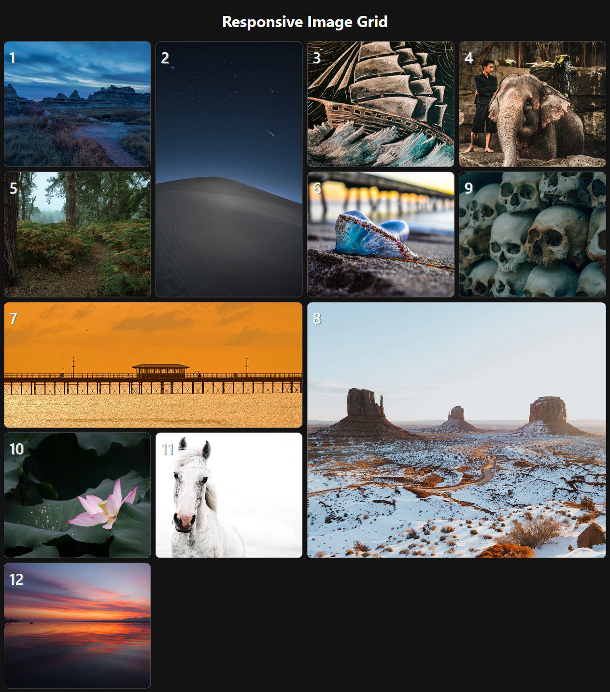
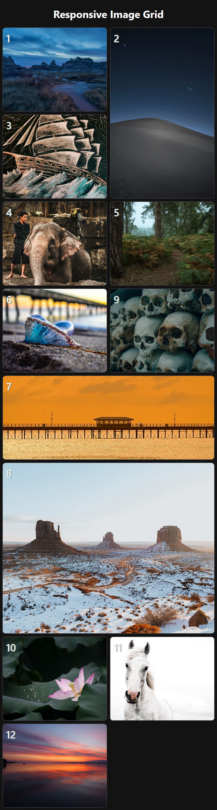

### *...Work in Progress - 10th Layout coming soon*


--- 

--- 

#### Inspired From

- CSS Grid Course From Scrimba [https://youtu.be/t6CBKf8K_Ac]
- Deep Dive into CSS Minmax [https://ishadeed.com/article/css-grid-minmax/]
- Article Layout with Centered Image [https://mastery.games/post/article-grid-layout/]
- Article Layout with Full Bleed Image [https://www.joshwcomeau.com/css/full-bleed/]
- Google - 1 line Layouts [https://1linelayouts.glitch.me/]
- Fireship - 3 grid layouts [https://youtu.be/705XCEruZFs]

